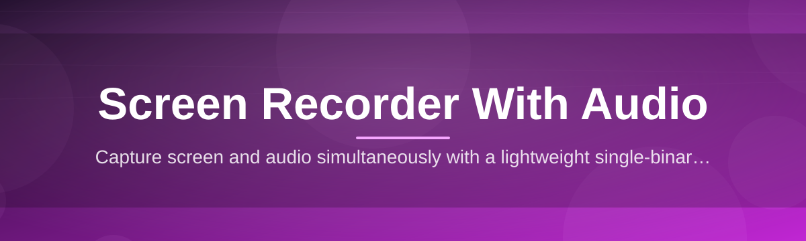
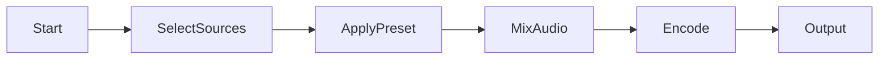

# 🎬 screen-recorder-config-editor 🔊

  

*The config layer that turns a plain screen recorder into a precision instrument for capturing screen and sound.*

## 🧭 Overview

Recording your screen sounds simple until you actually need it to sound *right*. Most screen recorders bury audio routing, bitrate, and encoder settings behind three menus and a prayer — and the moment you need mic + system audio mixed cleanly, you're stuck googling workarounds instead of recording.

**screen-recorder-config-editor** exists to fix that gap. It's a lightweight configuration layer built on top of Windows' native capture stack that gives you direct, visual control over every audio and video parameter a screen recording session actually needs — sample rates, input channels, loopback mixing, frame pacing, and output containers — without forcing you to hand-edit JSON or registry keys. Think of it less as "another screen recorder" and more as the mixing desk that sits in front of one.

It's built for streamers tuning their commentary levels, educators recording narrated tutorials, support teams capturing bug reports with voice explanations, and developers documenting workflows where "screen recording with audio" needs to mean *studio-usable audio*, not an afterthought. Whether you're capturing a full desktop walkthrough or a single application window with a live mic feed, this tool gives you the dials most recorders hide.

> [!NOTE]
> This project is a **configuration and control layer**. It manages settings, presets, and device routing for your screen and audio capture sessions — it does not replace your OS's capture permissions or drivers.

  

---

## ⚡ What It Actually Does

- **Dual-source audio mixing** — blend microphone input and system/loopback audio into one clean track, with independent gain sliders for each, so your narration never gets drowned out by notification pings.

- **Per-session presets** — save a "Tutorial Mode" config (mic-heavy, 30fps, window capture) alongside a "Gameplay Mode" config (system audio priority, 60fps, fullscreen capture) and swap between them in one click.

- **Live device detection** — plug in a new headset or capture card mid-session and the editor re-scans available input/output devices without requiring a restart.

- **Bitrate & container control** — fine-tune video bitrate, audio bitrate, sample rate (44.1kHz/48kHz), and choose MP4, MKV, or WebM output depending on what your editing pipeline prefers.

- **Region & window targeting** — define capture boundaries by pixel coordinates, snap-to-window, or full-display, with audio routing that stays consistent across all three modes.

- **Silence & noise gating** — automatically trims dead air from the audio track's monitoring meter so you know your mic levels are healthy before you hit record, not after.

- **Config export/import** — share a `.src-profile` file with a teammate so your entire team records tutorials with matching audio levels and video settings.

- **Hotkey remapping** — rebind start, stop, pause, and mute-mic shortcuts to whatever doesn't collide with your other tools.

> [!TIP]
> If you record the same *type* of content often (say, weekly demo videos), build one preset once and never touch a slider again. Future-you will send thanks.

---

## 🚀 How to Get Started

1. **Visit the landing page** using the download button above — that's the only official source for builds.

2. **Download the latest installer** for Windows 10 or 11.

3. **Run the installer** — no admin console commands, no package managers, no dependency chasing. Double-click, follow the prompts.

4. **Open the config editor**, pick or build a preset, select your microphone and capture source, and hit record.

> [!IMPORTANT]
> Always download from the official landing page linked in this README. Do not trust re-uploads on forums or file-sharing sites — they may be outdated or altered.

---

## 🖥️ System Requirements

| Requirement | Details |
|---|---|
| OS | Windows 10 (64-bit) or Windows 11 |
| RAM | 4 GB minimum, 8 GB recommended for longer sessions |
| Disk | ~150 MB for the app, plus space for recordings |
| Audio | Any Windows-recognized input/output device (mic, headset, interface) |
| Dependencies | **None** — fully standalone, no runtime installs required |

  

---

## 🛠️ How It Works

The editor sits between you and Windows' native capture APIs, translating your preset choices into a live capture session in a handful of predictable steps:

1. **Select sources** — you choose a display/window region and pick mic + system audio inputs.
2. **Apply preset** — the editor loads your saved config (bitrate, sample rate, gating, hotkeys).
3. **Route audio** — mic and loopback streams are mixed according to your gain settings.
4. **Encode & write** — video and audio are muxed together into your chosen container in real time.
5. **Save output** — the finished file lands in your configured output folder, ready to edit or share.

---

## 🧩 Troubleshooting

<strong>My microphone audio is too quiet compared to system sound.</strong>

 

Open your preset's audio panel and raise the mic gain slider independently of the system audio slider — they're mixed separately, so boosting one won't distort the other.

<strong>The recorder isn't detecting my new USB headset.</strong>

 

Unplug and replug the device, then use the "Rescan Devices" button in the input dropdown. Windows sometimes needs a moment to register the new device before the editor can list it.

<strong>My exported video has audio drift over long recordings.</strong>

 

Switch your sample rate to 48kHz if you're currently on 44.1kHz, and confirm your frame rate preset matches your display's native refresh rate. Mismatches compound over longer sessions.

<strong>Can I record system audio without a microphone plugged in?</strong>

 

Yes — set the input source to "System Audio Only" in the preset editor and the mic channel will simply be excluded from the mix.

<strong>The app won't launch after a Windows update.</strong>

 

Right-click the executable, choose Properties, and confirm it isn't blocked under the Security tab. Windows occasionally flags fresh downloads until you explicitly unblock them.

> [!WARNING]
> Recording copyrighted audio or video content without permission may violate platform terms of service or local law. Use this tool responsibly and only capture content you have the right to record.

---

## 🎨 UI / UX Details

The interface leans minimal by design — a single main window with a sidebar for presets and a bottom bar for live audio meters.

**Keyboard shortcuts** (fully remappable):

| Action | Default Shortcut |
|---|---|
| Start / Stop Recording | `Ctrl + Shift + R` |
| Pause / Resume | `Ctrl + Shift + P` |
| Mute Microphone | `Ctrl + M` |
| Open Preset Panel | `Ctrl + Shift + O` |

**Themes:** Light, Dark, and an auto mode that follows your Windows system theme.

**Settings persistence:** every preset, hotkey remap, and device selection is saved locally and reloaded automatically the next time you launch the app.

> [!TIP]
> Dark theme plus the low-profile floating recording indicator is the combo most streamers land on for distraction-free capture.

---

## 🤝 Contributing & Community

Contributions, bug reports, and feature ideas are genuinely welcome — this project grows because people using it for real screen recording with audio workflows tell us what's missing.

- Open an issue for bugs, with your Windows version and a description of your audio setup.
- Suggest presets or workflow ideas via discussions — the best default profiles often come from real users.
- Pull requests should target one change at a time and describe the "why," not just the "what."

> Every well-written bug report saves someone else's afternoon. Thank you for filing one.

---

## 📄 License

Released under the [MIT License](LICENSE), 2026. Use it, fork it, build on it — just keep the license notice intact.

---

## ⚠️ Disclaimer

This tool is provided "as is," without warranty of any kind. It is intended for legitimate screen and audio recording purposes such as tutorials, documentation, streaming, and support workflows. The maintainers are not responsible for misuse, including recording content without proper consent or rights. Always respect privacy and copyright when capturing screen and audio.

  

